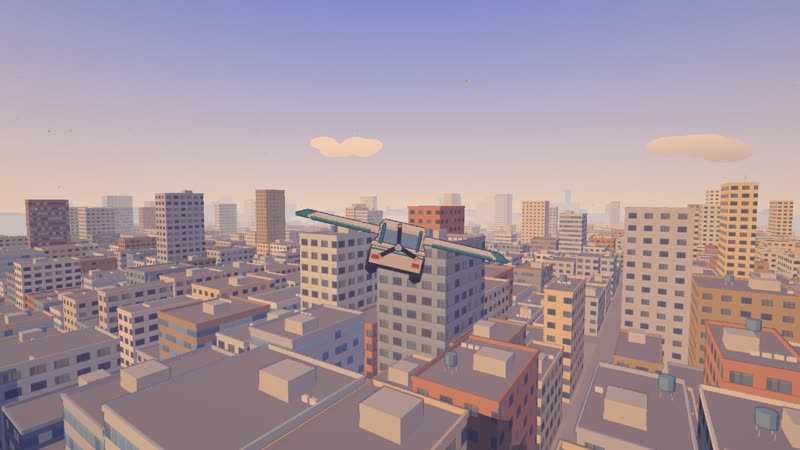
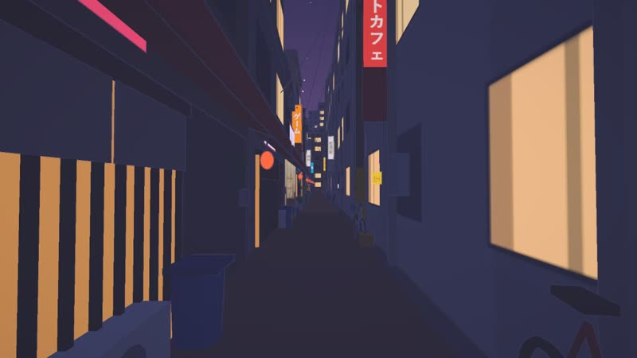
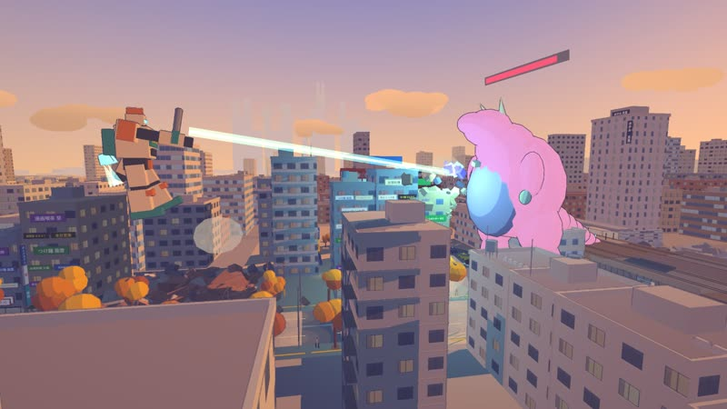
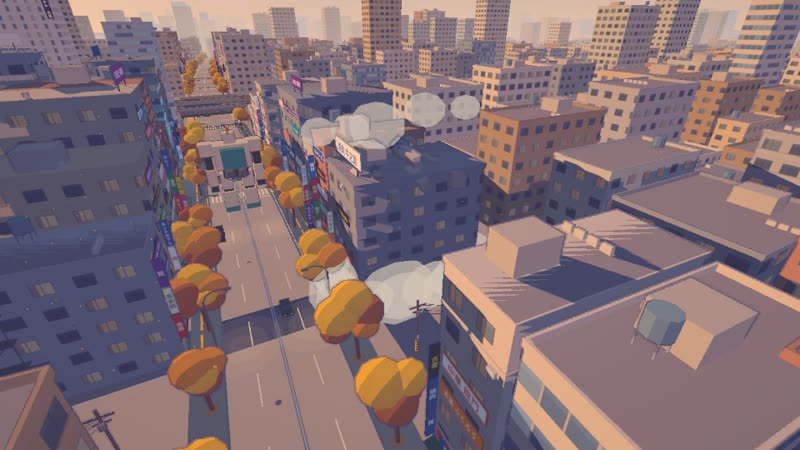

# Explore3D Template — アニメ背景風 3D 探検テンプレート

実在の場所（Google マップのスクショ）・乗り物・季節・テイストを伝えると、Claude Code が
このテンプレートを改変して **歩ける／乗れる「アニメ背景風」の 3D 世界** を作ってくれる、という土台です。

## こんなのが作れます：「馬場の空 — 秋」

→ リポジトリ：**[n416/baba-no-sora](https://github.com/n416/baba-no-sora)**

ストリートビューのスクショ **3 枚**と、ヒアリングへのいくつかの答えだけで、ここまで作り替えられました。

> 場所は高田馬場、季節は秋、テイストは新海誠風の光と空。乗り物は……**飛行機**。
> 「道から飛ぶ感じで。車に翼がある感じ」

| ガード下（昼） | ガード下（夕方） | 早稲田通りの夜 |
|---|---|---|
|  |  |  |
| **翼のある車で飛ぶ** | **夕方の上空から駅とロータリー** | **赤ちょうちんの路地** |
|  |  |  |

- 🛩 **テンプレートに無い乗り物も作れる**：翼を畳んだレトロな軽自動車で早稲田通りを走り、58 km/h で離陸。
  街の上を自由に飛んで、道路に降りれば着陸。C キーで駅の上を周回する遊覧飛行、コックピット視点、VR にも対応。
- 🏙 **田舎道が都会に変わる**：線路のガード（黄黒の縞と「制限高 4.2M」）、駅前ロータリー、赤い格子のビル、
  看板だらけの雑居ビル、飲み屋の路地、上を走る電車、600 m 四方の街並みと、地平線に浮かぶ副都心。
- 🌇 **テイストも作り替わる**：秋のいわし雲、太陽のグレア、夕方は金色の日向と青紫の日陰、
  夜は看板・窓・店内・ちょうちんが一斉に灯る。
- 🔁 **Claude が自分で撮って直す**：参考写真と並べて講評する反復を 5 回まわしたあと、場所らしさトップ 10 を作り込み。
  自動テストで「走り切る・離陸する・周回する・ぶつからない・着陸する」まで確かめています。

### 続けて頼めば、ゲームにもなる

出来上がったあとに「乗り物をロボットにして街を壊したい。ビームを撃ったり、バーニアで飛んだり。
少し壊すと怪獣が来て、倒すと最初に戻る。怪獣の体力はゲージで」と頼んだら、こうなりました。

| バーニアで浮いてビーム、体力ゲージ付きの怪獣 | ビームで崩れる雑居ビル |
|---|---|
|  |  |

さらに「サーベルを全身で振って」「横薙ぎは両手で」「動きに余韻を」「コンボが構えに戻らずつながるように」
「落下が軽すぎる、Ctrl で急降下」「ブースト中は集中線を」と注文を重ねていった結果がこちら（動きはすべて等速、両手持ちのみ 1/3 スロー）。

| ビームサーベルの連続技 | 両手持ちの横薙ぎと唐竹割り |
|---|---|
|  |  |
| **ブースト中はロボット中心の集中線** | **重い自由落下、着地前の減速噴射、上昇中からの急降下** |
|  |  |

- 🤖 全高 20 m のロボットで歩く・ダッシュする・バーニアで飛ぶ・屋上に降りる。左クリックでビーム
- ⚔ 怪獣に近づくと背中からビームサーベル。4 つの技がつながる連続技、両手持ち、踏み込み、ヒットストップ
- 🏚 1,200 棟以上の建物が壊せる。土煙を上げて沈み、瓦礫の山が残る
- 🦖 6 棟壊すと架空の怪獣が地面から現れ、ビルを踏み潰しながら迫ってくる。体力ゲージを削り切ると街が元通りに
- 🥽 VR でも同じように遊べる（怪獣の頭上にゲージ、照準は顔の向き）

店名・看板・壁画・怪獣はすべて架空です（このテンプレートの約束）。作った世界はテンプレートとは別のリポジトリになります。

## 使い方

Claude Code にこう伝えるだけです。

```
https://github.com/n416/explore3d-template から落として PROMPT.md を読んで始めて
```

あとは Claude に聞かれたことに答えていけば進みます（乗り物、場所のスクショ、テイスト、季節、VR 機器、人を出すか、作り込みレベル）。

**どう動き回るかは自由にどうぞ。** 歩く、自転車、軽トラはもちろん、スパイダーマンみたいに糸でビルの間を飛び回るアクションでも、
飛行機でも、キックボードでも、巨大ロボットでも。テンプレートに無いものは Claude が作ります
（「馬場の空」の翼のある車も、テンプレートには無かった乗り物です）。
「この世界の約束・禁止事項・場所らしさトップ 10」の案が出てきたら確認して OK するだけで、
そこから先は Claude が「作る → 撮る → 参考画像と比べて直す」を繰り返して仕上げます。

### ディテールアップ

一発で完成はしないので、出来上がった後も気になるところを指定して作り込めます（手順は [DETAIL.md](DETAIL.md)）。

- 部品で：「家をディテールアップして」「自転車を作り込んで」
- 地点で：「03 の地点を作り込んで」
- カテゴリで：「道路まわり」「植物」「夜の見え方」
- 強さ：「軽く」「とことん」

## すでに入っているもの

- **セル調の見た目**：量子化した光＋影を紫に色相シフト、深度の二階差分による墨線、主役の輪郭線、スプリットトーン
- **時刻インジケーター**：画面下のスライダーで 0〜24 時を連続変化。緯度と季節から太陽の位置を計算（夏は高く冬は低い）。
  夜は窓・自販機・ライトが点灯、星。▶ で 1 日を 60 秒で早送り
- **季節**：植生の色と粒子（春は花びら、夏は夜の蛍、秋は落ち葉、冬は雪）
- **移動**：徒歩／乗り物（ママチャリ・原付・軽トラ）／両方（F で乗り降り）
- **VR（WebXR）**：着座・一人称・水平固定・スナップターン・移動中の周辺減光・左手首の時計
- **検証**：`__shot()` でフレームを保存、`npm run shoot` で全地点×4 時刻を撮影、`npm run explore` で自動運転テスト

## 操作

| キー | |
|---|---|
| W A S D / 矢印 | 移動・運転 |
| マウス | 視点 |
| Shift | 走る・加速 |
| F | 乗る／降りる |
| V | 一人称／三人称（乗車時） |
| T | 朝→昼→夕方→日没→夜 に時刻ジャンプ |
| P | 時刻の早送り |
| R | スタートに戻る |
| O / G | 墨線／グレードの切替 |

**VR**：右トリガー 前進、左トリガー ブレーキ、右スティック 旋回、左スティック 歩く、A 乗り降り、B 視点リセット、
X 早送り、左グリップ＋左スティック上下 で時刻を回す。`npm run dev:vr` で HTTPS・LAN 公開し、ヘッドセットのブラウザから開く。

URL で上書き：`?time=18.5&season=autumn&mobility=walk&vehicle=keiTruck`

## 仕組み

構成・規約・既知の罠は [CLAUDE.md](CLAUDE.md)、作り替えの手順は [PROMPT.md](PROMPT.md)、作り込みの手順は [DETAIL.md](DETAIL.md)。

## 注意

- Google マップ／ストリートビューの画像は参考用です。`refs/` は `.gitignore` 済みなので公開リポジトリに含めないでください。
- 看板などの店名・ブランドは架空のものにしてください。
- VR の酔いや操作感は実機でしか確かめられません。

## 参考にしたプロジェクト

- [Kenton-GMI/sakura-crossing](https://github.com/Kenton-GMI/sakura-crossing) — 墨線・影の色相シフト・検証の進め方
- [StarKnightt/summer-cycle](https://github.com/StarKnightt/summer-cycle) — 参考画像と Builder/Critic のループ

MIT License
